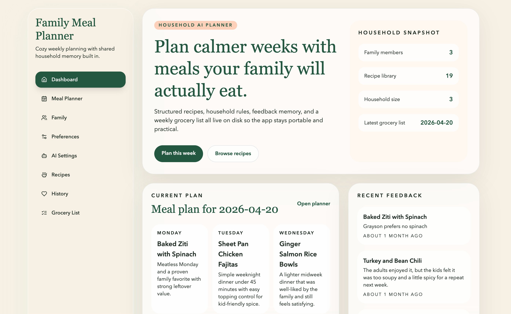

# Family Meal Planner

> [!WARNING]
> This repository is an unmaintained MVP shared for reference, experimentation, and community forks.
> It is not actively supported, has known MVP tradeoffs, and should not be treated as a production-ready maintained product.
> Personal and non-commercial use are allowed under the included license. Commercial rights are reserved by Clayton Smith and require prior written permission.

Family Meal Planner is a production-style MVP built with Next.js App Router, TypeScript, Tailwind CSS, and a filesystem-first storage layer. It plans weekly dinners with server-side OpenAI integration while keeping recipes, family preferences, meal history, grocery lists, and AI logs in Markdown files with YAML frontmatter.

## Screenshot



## Project status

- MVP prototype
- Shared as-is
- Not actively maintained
- No support commitment or release schedule

If you want to build on it, fork it and make it your own.

## License

This project is released under the included `LICENSE` file for personal and
non-commercial use only.

Clayton Smith retains all commercial rights to the project. No commercial
license is granted through this repository.

If you want to use this project, or any derivative of it, for a commercial
purpose, you must obtain prior written permission from Clayton Smith.

## Support and reporting

- Contribution guidance: see [CONTRIBUTING.md](CONTRIBUTING.md)
- Security reporting: see [SECURITY.md](SECURITY.md)
- This repository is shared as-is and may not receive responses to issues or
  pull requests

## Highlights

- Natural language meal planning with structured JSON output from the server
- Filesystem-backed persistence with Markdown + YAML frontmatter
- No database required
- Centralized repository layer with atomic writes and in-memory caching
- GUI-configurable AI providers with server-side secret storage
- Generic seed data for a sample household
- Docker-ready with mounted persistent data at `/saved-data`

## Stack

- Next.js App Router
- TypeScript
- Tailwind CSS
- OpenAI Node SDK
- `gray-matter` for Markdown parsing

## Data layout

The app persists all records into a configurable data directory.

```text
/saved-data
  /family-members
  /preferences
  /recipes
  /meal-plans
  /feedback
  /grocery-lists
  /ai-logs
  /ai-settings
  /secrets
```

Each record is a Markdown file with YAML frontmatter and a Markdown body. Cross-links use stable IDs rather than names. Provider API keys entered in the GUI are stored separately in `/saved-data/secrets` so they stay server-side only.

## Local development

1. Copy the example env file.
2. Install dependencies.
3. Start the dev server.

```bash
cp .env.example .env
npm install
npm run dev
```

Open [http://localhost:3000](http://localhost:3000).

The planner uses AI provider settings configured in the app UI. If no enabled provider is configured, the planner still works using the built-in structured fallback planner. AI logs record whether the result came from a live provider or the fallback path.

## Docker

1. Copy the example env file.
2. Start the app with Docker Compose.

```bash
cp .env.example .env
docker compose up --build
```

The container listens internally on port `3000`. The external host port is configurable via `APP_PORT` in `.env`.

Persistent data is mounted from `./saved-data` on the host to `/saved-data` in the container.

## Docker via GHCR

This repository includes a GitHub Actions workflow that publishes a container
image to GitHub Container Registry from `main` and tagged releases.

If the image is available, you can run the app without building from source.

1. Copy the example env file.
2. Start the app with the GHCR compose file.

```bash
cp .env.example .env
mkdir -p saved-data
docker compose -f docker-compose.ghcr.yml up -d
```

By default, this pulls:

```text
ghcr.io/c1aytonnet/family-meal-planner:latest
```

Then open:

```text
http://localhost:3000
```

To stop it later:

```bash
docker compose -f docker-compose.ghcr.yml down
```

## Manual GHCR publishing

This repository is set up primarily for local Docker builds, but the image can
also be published manually to GitHub Container Registry if needed.

Expected image name:

```text
ghcr.io/c1aytonnet/family-meal-planner:latest
```

One-time example publish flow:

```bash
echo "$GH_TOKEN" | docker login ghcr.io -u c1aytonnet --password-stdin
docker build -t ghcr.io/c1aytonnet/family-meal-planner:latest .
docker push ghcr.io/c1aytonnet/family-meal-planner:latest
```

The GitHub token used for publishing must have package write permissions.

## Seed data behavior

The repository layer initializes the configured data directory from `./seed-data` when a collection is empty. This makes first boot usable while keeping runtime edits inside the mounted persistence directory.

The committed seed data is intentionally generic. Do not commit your populated `saved-data` directory, API secrets, or private household records.

## Project structure

```text
app/
  api/
  planner/
  family/
  preferences/
  recipes/
  history/
  grocery-lists/
components/
lib/
  ai/
  storage/
seed-data/
```

## Notes

- All filesystem reads and writes go through the storage repositories in `lib/storage`.
- Atomic writes are used for Markdown persistence to reduce partial write risk.
- The in-memory cache is invalidated when records are updated and the app continues to function if the cache is empty.
- Recipes remain the source of truth; the planner only chooses from stored recipe IDs.
- API provider keys are stored server-side in the mounted data directory; review the security model before using this outside a trusted environment.
- There is no built-in authentication layer in this MVP.

## GitHub publishing notes

- Keep `.env` local to each deployment environment.
- Keep `saved-data/` out of source control.
- Review any copied recipe content and external source material before publishing a fork.
- Expect to own future maintenance if you decide to adopt this project.
- Commercial use is not permitted under the public repository license without prior written permission from Clayton Smith.
